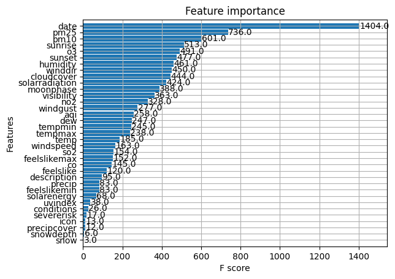
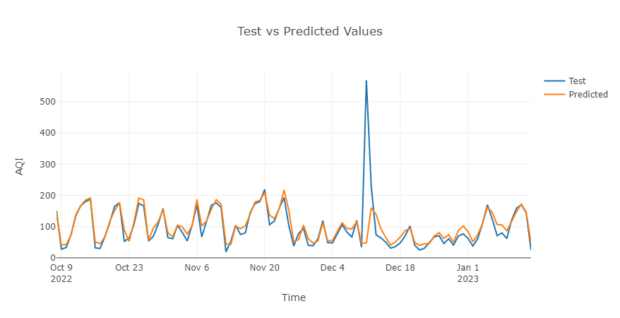
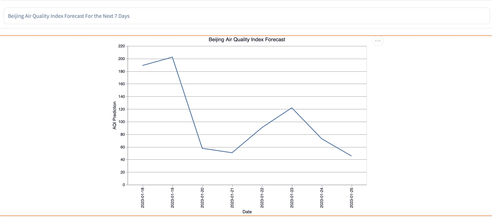

<h1>Project</h1>

<h2>Purpose</h2>

The purpose of the project is to build a scalable Prediction service using a real world data source. The source is supposed to be updated regularly and the results should include air quality prediction for the following 7 days, for a specific city. The predictions should then be communicated via an UI.

<h2>Libraries</h2>

- Pandas
- Modal
- Hopsworks
- Gradio
- XGBoost
- Joblib
- Numpy
- Datetime

The code was written using Python 3.9.

<h2>Setup</h2>

1. Install requirements
2. Run the upload_data.py script at ./Util/upload_data.py

<h2>Project Architecture</h2>

This project is divided into 4 parts:

1. Backfill
2. Feature pipeline
3. Training pipeline
4. Prediction pipeline

<h2>Data</h2>

Historical data and APIs have been collected from both https://aqicn.org/api/ (air quality) and https://www.visualcrossing.com/ (weather). The city chosen was Beijing. The backfill data can be found in the ./Data directory. The data collected contains air quality related features such as pm25 and o3, and weather related features such as temperature and humidity. Both data sources comes with a date feature.

We could not get the historical AQI for Beijing, but since we had the quality index of each respective pollutant, we could calculate the AQI by just taking the maximum value for each day.

<h2>Model</h2>

Our initial idea was to use XGBoost as a baseline and then train a neural network as a main model. However, with just ~900 days of weather and air quality data, it did not seem like a good idea to implement a neural network. Instead, we opted for an XGBoostRegressor. In order to tune the hyperparameters we used GridSearch.

To train the model for it to be able to predict values into the future, we opted for a strategy where the goal was to predict the next day's AQI. In order to do that, we did a timeline split with ~850 consecutive days for training and ~100 days for test. We then added a feature representing tomorrow's AQI by duplicating the AQI feature and shifting it one day forward. That means each row had the actual day's AQI and tomorrow's AQI. Tomorrow's AQI was then dropped and used as label.

<h2>Implementation</h2>

<h3>Backfill</h3>

backfill_feature_groups.py loads historical data about weather and air quality for Beijing. Some columns get dropped. It then connects to Hopsworks and creates a feature group for both weather and air quality. It backfills from .csv files saved in Hopsworks.

<h3>Feature pipeline</h3>

feature_pipeline.py can be run daily, as it fetches actual weather & air values from respective API and inserts into the feature groups.

<h3> Training pipeline</h3>

In the training pipeline, training_pipeline.py, a feature view is used, where the date columns of the weather feature group and the air quality feature group are joined. The complete dataset (~900 days of data) then passed to column transformers.

The numerical data is passed via an standard scaler while the categorical values are passed through an ordinal encoder before reaching the XGBRegressor.

The training pipeline can be set to run every one month or so. That would fix eventual skews that has happened since the model can make use of newer predictions.

<h3>Prediction pipeline</h3>

Lastly, the prediction_pipeline.py collects forecasts of weather and air quality. The model is then retrieved and predicts air quality by using the earlier collected forecasts. The results are uploaded to Hopsworks in a .csv file.

<h2>Results</h2>

<h3>Model performance</h3>

Figure 1. Feature Importance

Figure 2. Prediction vs test set

Figure 1 displays the importance of the various features. It can be concluded that the air quality features such as pm25 and o3 is very significant. However, many weather related features are important as well, humidity for example. Figure 2 displays the predicted air quality compared to the test values. It is strongly correlated as can be seen in the figure. However, it is important to keep in mind that the model might be a bit overfitted. Chi-Squared fit was calculated to test the goodness of fit of an observed data point to the predicted, and the results were a value of 0.40.

<h3>Inference UI</h3>

Figure 3. Hugging Face interface

Hugging Face URL: https://huggingface.co/spaces/tlord/air_quality_index
